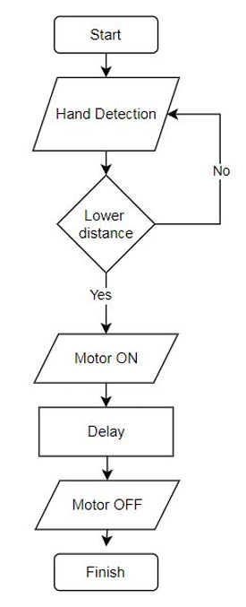

# Automatic-Handwash-Dispenser-Using-ATmega328P-microcontroller
The developed Automatic Handwash Dispenser uses an ATmega328P microcontroller, an ultrasonic sensor, and servo motor to dispense soap touchlessly when a hand is detected. It promotes hygiene, reduces infection spread, and is ideal for homes, healthcare, and public spaces, showcasing embedded systems in automation.
## Components
- ATmega328P Microcontroller
- Ultrasonic Sensor (HC-SR04)
- Servo Motor (e.g., SG90)
- Jumper Wires
- Capacitor
- 16 MHz Clock Crystal
- AVR Programming Adapter
- FT232 USB to Serial Board

## Flowchart

## How It Works
1. The ultrasonic sensor detects a hand within a specified distance.
2. The ATmega328P processes the signal and activates the servo motor.
3. The servo motor dispenses a predetermined amount of soap.
4. The pump operates for a set duration before turning off.

## Setup Instructions
1. Connect the components as per the circuit diagram (see `schematics/` folder).
2. Upload the code from `code/main.ino` to the ATmega328P using the AVR Programming Adapter and FT232 USB to Serial Board.
3. Test the system by placing a hand near the ultrasonic sensor.
